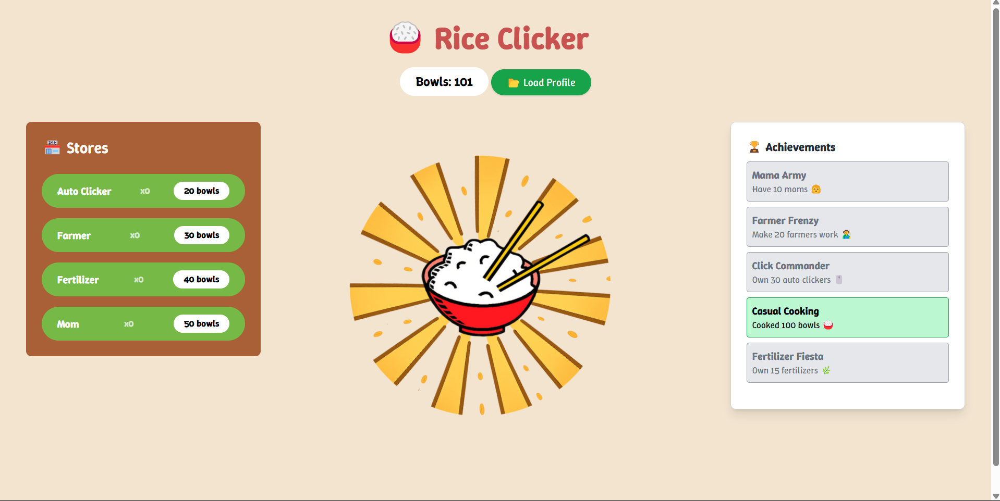
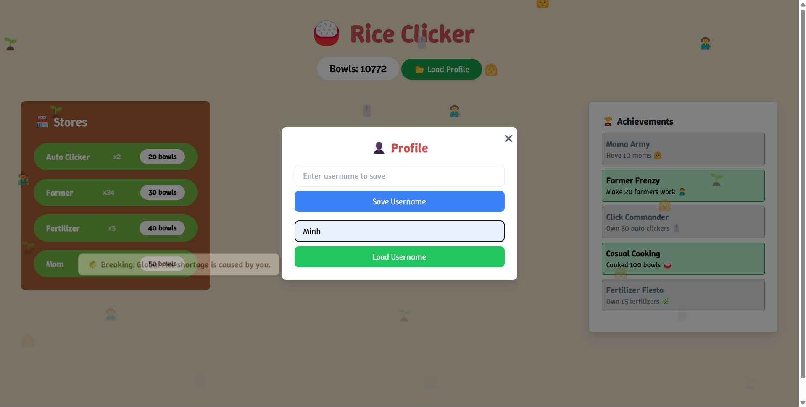
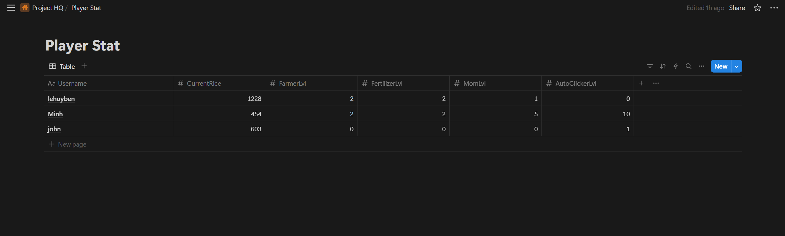

# 🍚 Rice Clicker

**Rice Clicker** is a clicker game where you grow your rice empire one bowl at a time. Click the rice bowl, buy upgrades, unlock achievements, and watch as your screen rains with rice emojis, workers, and chaotic mom energy.

---

## 🎮 Features

- **Clickable Bowl**: Click to cook more rice bowls.
- **Upgrade Store**: Buy Auto Clickers, Farmers, Fertilizer, and Moms to automate your rice growth.
- **Achievement System**: Unlock fun goals like *Mama Army* or *Farmer Frenzy*.
- **Emoji Rain**: Watch emoji workers fall from the sky when hired.
- **Quote Rain**: Random rice-related news and wisdom rain down periodically.
- **Stylized UI**: Custom-tailored with TailwindCSS and fun animations.
- **Save/Load Support**: Store progress using a Notion database backend.

---

## 🛠️ Tech Stack

- **Frontend**: HTML, CSS (Tailwind), JavaScript
- **Backend**: Node.js + Express
- **Database**: [Notion API](https://developers.notion.com/) for saving and loading game progress

---

## 🚀 Getting Started
### 1. Clone the Repository
### 2. Install Server Dependencies
```bash
npm install
```

### 3. Set Up .env for Notion API
Create a **.env** file in the root of your server directory:
```bash
NOTION_API_KEY=your_notion_secret_key
NOTION_DATABASE_ID=your_database_id
```

### 4. Run the Server
```bash
node server.js
```

### 5. Open the Game
Open index.html in your browser (you can use Live Server or a local static server).

## Screenshots





